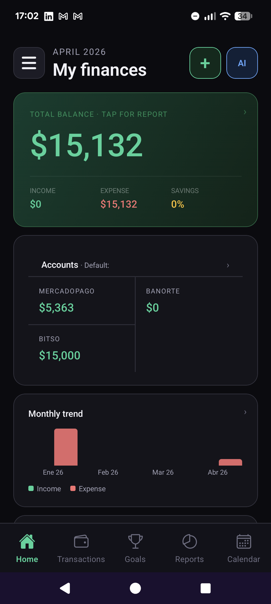
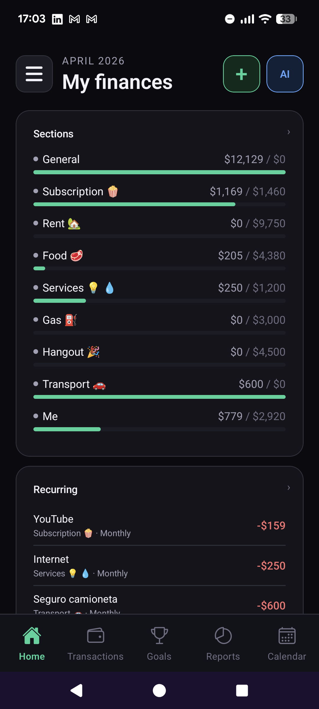
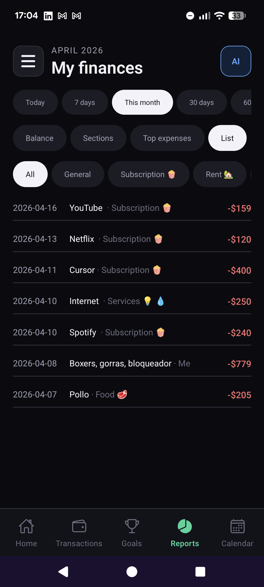
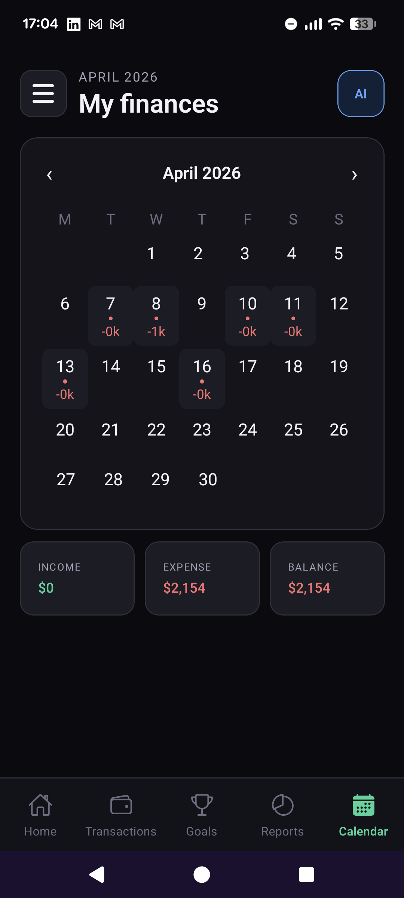
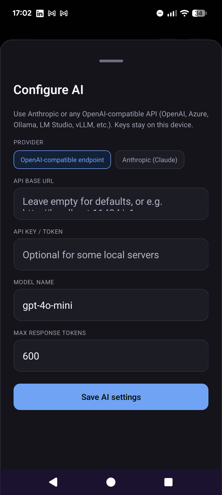
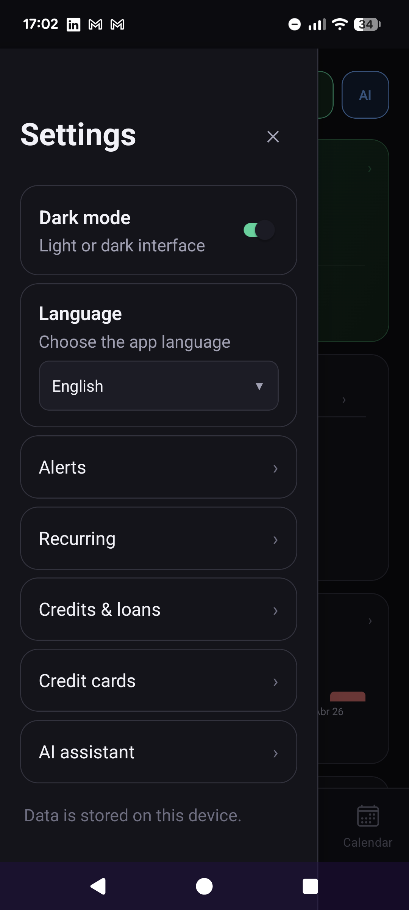
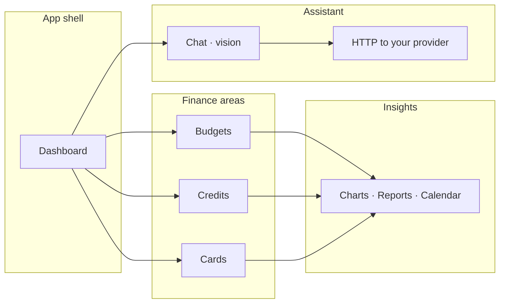
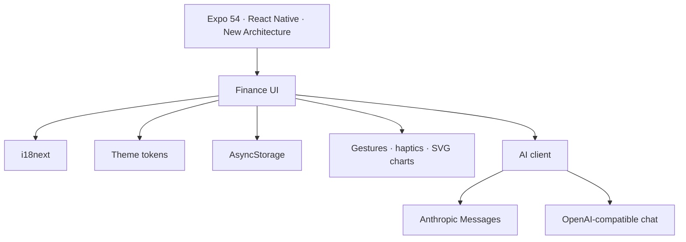

<!-- Budget fin pro — repository overview -->

<div align="center">

<picture>
  
</picture>

# Budget fin pro

**Personal finance for Android and iOS — clear dashboards, strict privacy, and an assistant powered by the model you choose.**

Expo · React Native · TypeScript · **BYOK AI** (Anthropic or OpenAI-compatible, local or cloud)

<br />

[](https://expo.dev/)
[](https://reactnative.dev/)
[](https://www.typescriptlang.org/)
[](./src/utils/aiProvider.ts)


</div>

---

## Preview

Real device captures from the project. **Dark UI** is the default; themes and **14+ locales** are built in.

<table>
  <tr>
    <td width="50%" align="center" valign="top">
      <b>Dashboard</b><br />
      <sub>Balances, accounts, monthly trend</sub><br /><br />
      
    </td>
    <td width="50%" align="center" valign="top">
      <b>Budget & sections</b><br />
      <sub>Category progress and recurring items</sub><br /><br />
      
    </td>
  </tr>
  <tr>
    <td align="center" valign="top">
      <b>Reports</b><br />
      <sub>Time ranges, views, and expense lists</sub><br /><br />
      
    </td>
    <td align="center" valign="top">
      <b>Calendar</b><br />
      <sub>Daily spend markers on the month grid</sub><br /><br />
      
    </td>
  </tr>
  <tr>
    <td align="center" valign="top">
      <b>Configure AI</b><br />
      <sub>Provider, endpoint, model — keys on device</sub><br /><br />
      
    </td>
    <td align="center" valign="top">
      <b>Settings</b><br />
      <sub>Credits, cards, language, dark mode</sub><br /><br />
      
    </td>
  </tr>
</table>

<p align="center"><sub>Screenshots live in <code>docs/screenshots/</code>. Replace or add PNGs there to refresh the gallery.</sub></p>

---

## Contents

- [AI assistant](#ai-assistant--bring-your-own-model)
- [Product highlights](#product-highlights)
- [Architecture](#architecture)
- [Getting started](#getting-started)
- [Repository layout](#repository-layout)
- [Brand](#brand)

---

## AI assistant — bring your own model

The app is **AI-ready without lock-in**: you choose **Anthropic (Claude)** or any **OpenAI-compatible** API — including **OpenAI**, **Azure**, **Ollama**, **LM Studio**, **vLLM**, and similar. Credentials are stored **only on the device** (`AsyncStorage`).

| | |
|:--|:--|
| **Chat** | Full thread with a **localized system prompt** tied to the active app language. |
| **Vision** | Attach images (e.g. receipts); multimodal payloads for supported models. |
| **Ledger actions** | The UI can **parse structured model output** and register matching transactions. |

**Code:** [`src/utils/aiProvider.ts`](./src/utils/aiProvider.ts) · AI surface in [`src/screens/FinanceScreen.tsx`](./src/screens/FinanceScreen.tsx)

---

## Product highlights

| | |
|:---|:---|
| **Configurable AI** | Same app, **your** API keys and endpoints — cloud or local inference. |
| **Customizable home** | **Draggable** dashboard widgets. |
| **Deep dives** | Budgets, loans, and credit cards in focused screens — not endless nested tabs. |
| **Charts** | Line, bar, and pie views for trends and breakdowns. |
| **Localization** | **14** languages (e.g. English, Spanish, Arabic, Japanese). |
| **Theming** | Dark and light, aligned with system appearance. |
| **On-device data** | Core ledger in **AsyncStorage** — no mandatory cloud account for budgeting. |

---

## Architecture

### Product flow



### Stack



---

## Getting started

**Prerequisites:** Node.js, the [Expo toolchain](https://docs.expo.dev/get-started/installation/), and — for device builds — Xcode and/or Android SDKs as needed.

```bash
git clone https://github.com/YOUR_ORG/budget-fin-pro.git
cd budget-fin-pro
npm install
npm start
```

Use **`i`** (iOS simulator), **`a`** (Android), or **`w`** (web) from the Expo CLI.

### Enable AI (quick)

1. Open **AI** from the main screen → open **configuration** in the assistant.
2. Pick **Anthropic** or **OpenAI-compatible**.
3. Set **API key** if required, **base URL** for non-default hosts (e.g. local Ollama), and **model** name.
4. Save. Treat keys like production secrets.

### npm scripts

| Script | Purpose |
|:--|:--|
| `npm start` | Development server |
| `npm run android` | Run on Android |
| `npm run ios` | Run on iOS |
| `npm run web` | Web preview |
| `npm run format` | Prettier (`src/`, `App.tsx`, `index.ts`) |
| `npm run build:apk:eas` | Android build via [EAS](https://docs.expo.dev/build/introduction/) (`preview`) |

---

## Configuration highlights

| Key | Value |
|:--|:--|
| **Display name** | Budget fin pro |
| **Expo slug** | `budget-fin-pro` |
| **Android application ID** | `com.quielo.budgetfinpro` |
| **iOS bundle identifier** | `com.quielo.budgetfinpro` |
| **EAS** | Project id in `app.json` → `expo.extra.eas.projectId` |

---

## Repository layout

```text
App.tsx
src/
  FinanceApp.tsx        # Theme, i18n, shell
  screens/              # Finance + AI orchestration
  components/           # Charts, modals, lists, widgets
  theme/                # Tokens & ThemeContext
  i18n/
  utils/
    aiProvider.ts       # Providers, multimodal requests
    …                   # Money, dates, credit math, formatting
assets/                 # Icon, splash, favicon
docs/screenshots/       # README gallery assets
```

---

## Brand

Primary **teal** `#0B3D4D` is used on splash and adaptive icon backgrounds — built for clarity on long sessions, not loud marketing gradients.

---

<div align="center">

**Budget fin pro** · Expo · React Native · TypeScript

Built for users who want **local-first** budgeting and **optional**, **provider-controlled** AI.

</div>
